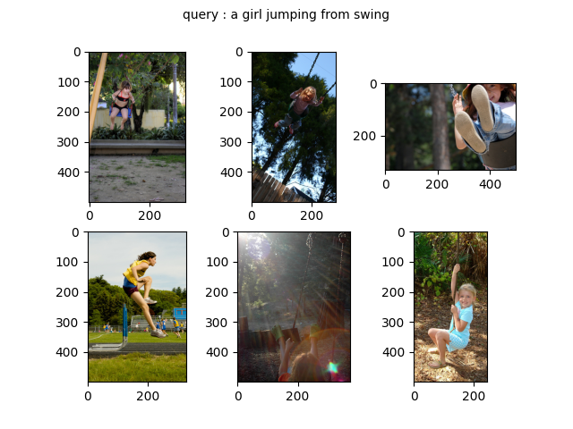

# CLIP 

## Introduction
CLIP implementation\
This is quick implementation of CLIP (Contrastive Language-Image Pre-Training).
CLIP can do projection sentence and image to same dimention and compaire them.

## Requirements

## Datasets
Dataset(image-caption) pair for training and validation is made from Flickr 8k dataset(https://www.kaggle.com/datasets/adityajn105/flickr8k).
Its collection for sentence-basead image description and search, consist of 8000 images that are each paired.
Pair is chosen from six differenct original Flickr group, and tend not to contain any well-kwnon peple or locations.

 \

## Results

 \

## References
- [1] Open-AI CLIP 
https://github.com/moein-shariatnia/OpenAI-CLIP
- [2] CLIP-tutorials
https://towardsdatascience.com/simple-implementation-of-openai-clip-model-a-tutorial-ace6ff01d9f2